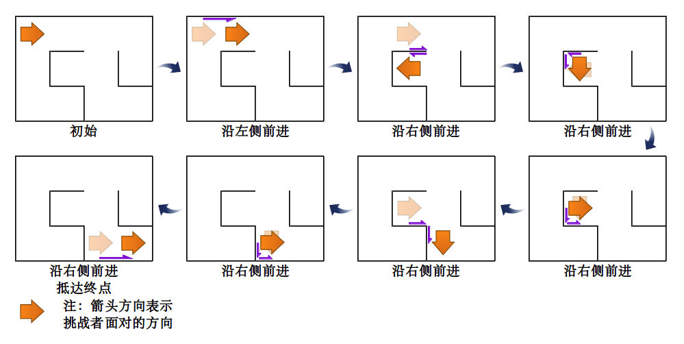

## 「LibreOJ Round #9」ZQC 的迷宫

### 题目描述

**请注意最下方添加内容。**

**本题是一道交互题。**

位于 $n\times m$ 个方格组成的黑暗迷宫的你，需要走到这个迷宫的终点，以完成迷宫挑战。

最开始，你位于迷宫的起点即 $(1,1)$ 处，且面向右侧，终点位于 $(n,m)$ 处。迷宫中任意两个方格之间均联通，且仅有唯一的一条路径，两个相邻（即上、下、左、右四联通）方格间长度为一个单位长度。两个相邻方格之间可能会有墙壁，墙壁厚度相对于方格而言非常小，粗略不计。迷宫的边界均有墙壁，且每一堵墙壁均与边界联通。迷宫是完全黑暗的，这意味着，你无法得到除 $n,m$ 以外的任何信息。

为了在黑暗条件下尽量不迷路，每次前进时你只能从当前格子出发，沿着左侧或右侧墙壁，左手或右手扶着墙壁前进，并且使**扶着墙壁的手**移动距离恰好为一个单位长度。需要注意的是，若左侧或右侧墙壁不存在，则沿该侧方向无法前进。

在黑暗中过久的你会感到恐惧，因此你需要在你尽早走出迷宫。如果你没有在限定步数内走出迷宫，挑战将会失败。

下图表示一个迷宫的例子，以及一个可行的前进方法：



#### 交互方式

可供调用的操作有：

1. `move_left` 表示沿左侧前进一个单位长度。返回值为 `0` 表示操作不合法，为 `1` 表示操作合法。
2. `move_right` 表示沿右侧前进一个单位长度。返回值为 `0` 表示操作不合法，为 `1` 表示操作合法。
3. `reverse` 表示向后转，即面向方向旋转 $180^\circ$，位置不变。无返回值。
4. `reach_dest` 表示询问是否到达终点。返回值为 `0` 表示未到达终点，为 `1` 表示到达终点且交互器会自动退出。
5. `dist` 表示询问当前位置与终点的最短距离。返回值即为最短距离。

当你想要进行某个操作时，请向标准输出流 `stdout` 中写入如下格式的字符串：

```plain
<操作名称>
```

你**必须**在请求后追加换行符；多余的空白字符将被自动忽略。

在收到用户程序发送的请求后，交互器会向用户程序的标准输入流 `stdin` 中发送返回值。你只需在你的程序中使用通常的办法读入这个值，就好像是从控制台或文件中读取内容一样。交互器将在发送返回值后再附加一个换行符 `\n`，以便于用户程序读入。本题目的操作返回值都是数字，因此直接读入数字即可。

请注意，很多语言的输入与输出库都会带有缓存，请在写入操作请求后手动刷新缓存，以确保请求顺利递送。

C++ 语言可以这样刷新缓存（`std::endl` 会自动刷新缓存）：

```c++
std::cout << value << std::endl << std::flush;
// or std::cout << value << std::endl;
```

C 语言可以这样刷新缓存：

```c
printf("%d\n",value);
fflush(stdout);
```

Pascal 语言可以这样刷新缓存：

```pascal
writeln(value);
flush(output);
```

其它语言的刷新缓存方法请自行查阅资料。

确定抵达终点后，调用 `reach_dest` 操作后即可结束程序。交互器退出时，如果用户程序还在运行，就会被立即终止，但不会引发超时错误。

由于交互请求发送与返回值接收过程受到缓存区影响，请**务必接收返回值**以避免非预期情况发生。保证交互库在 $1\text{s}$ 内至少可完成 $1.8 \times 10^5$ 次交互操作，也即对于限制操作次数最小值 $600002$，调用交互操作 $600002$ 次并接收返回值所耗时间至多不超过 $3.5\text{s}$，这意味着选手至少有 $1.5\text{s}$ 的运行时间。

若评测结果返回 <span class="status time_limit_exceeded"><i class="clock icon"></i>Time Limit Exceeded</span> 且非时间复杂度方面原因，请注意程序是否已经在写入操作请求后刷新缓存，或是程序是否一直尝试进行不合法的前进操作。返回 <span class="status invalid_interaction"><i class="icon ban"></i>Invalid Interaction</span> 请注意程序是否尝试调用不存在的操作。

#### 任务

你需要提交一个程序，使用上述操作完成迷宫挑战。

在初始时，交互器会向用户程序的标准输入流 `stdin` 中发送一行四个整数 $n, m, l, d$。其中，参数 $n$ 表示迷宫长度，$m$ 表示迷宫宽度，$l$ 表示可供调用的前进操作次数，$d$ 表示可供调用的询问距离操作次数。需要注意的是，前进操作包括 `move_left` 与 `move_right`，也即调用二者之一均会减少可供调用的前进操作次数，不合法操作不被计入函数调用次数统计。询问距离操作即 `dist` 操作。

在操作次数用尽后，该操作将不会执行并返回预期结果，而会返回 `0`。若前进操作调用次数用尽且未抵达终点，交互器将会终止用户程序运行。

#### 评分方式

对于每个测试点，令 $p$ 表示起点与终点的距离，$q$ 表示无可用前进操作次数时或抵达终点调用 `reach_dest` 操作后，你所在位置与终点的距离，该测试点得分百分比为 $\max({p-q \over p},0)$。

对于每个子任务，其得分为该子任务分值与每个测试点得分百分比的乘积。

若对交互器作出攻击，得分将作无效处理。

#### 如何在本地测试你的程序

由于评测机压力过大，现在下发[本题交互器与相同规模测试数据](/contest/32/1/download/additional_file)。对选手造成的不便深表歉意。请确保您能拿到尽量高的分数后在接近比赛结束时提交。

文件解压后有如下文件：

```plain
interactor.exe
interactor.cpp
interactor
input1
input2
input3
input4
input5
```

其中 `input*` 对应该子任务范围的数据，测试前，你需要将其重命名为 `input`。

#### Windows 系统

对于使用 Windows 系统的选手，你需要在与 `interactor.exe` 同一目录下放置 `input` 文件，用于输入交互器数据，若选手程序为 `user.exe`，请运行以下指令：

```plain
user.exe <&1 | interactor.exe >&0
```

该指令将输出评测结果 `Mission Completed. ` 或 `Mission Failed. `，同时将在同一目录下生成 `score.txt`，表示该测试点得分百分比。若为 `-1`，则表示不合法交互操作。

#### Linux 发行版系统

对于使用 Linux 发行版的选手，你需要在与 `interactor` 同一目录下放置 `input` 文件，用于输入交互器数据，若选手程序为 `user`，请运行以下指令：

```plain
{ ./interactor < /dev/fd/3 | ./user 3>&-; } 3>&1 | :
```

该指令将输出评测结果 `Mission Completed. ` 或 `Mission Failed. `，同时将在同一目录下生成 `score.txt`，表示该测试点得分百分比。若为 `-1`，则表示不合法交互操作。

#### 其他系统

对于使用 MacOS 等系统的选手，请自行编译 `interactor.cpp`，并参照上述方法测试你的程序。


### 数据范围与提示

对于所有数据，保证 $1\leq n,m\leq 500$。$l,d$ 限制见下表。

|子任务编号|分值|$n,m\leq$|$l\geq$|$d\geq$|
|:------------:|:----:|:------------:|:--------:|:--------:|
|1|$10$|$10$|$2333$|$2333$|
|2|$15$|$50$|$66666$|$6666$|
|3|$19$|$100$|$250002$|$10000$|
|4|$24$|$200$|$500002$|$20000$|
|5|$32$|$500$|$500002$|$100000$|
